# 🏆 Kreeda-Ankana App – Sports Management System

> Android App Development using GenAI – MindMatrix VTU Internship Program

A smart Android application to manage sports ground booking, match scheduling, and team coordination for village communities.

---


---

# 📌 Project Overview

Kreeda-Ankana is a smart Android application developed to organize village sports activities digitally. The application helps teams book sports grounds, schedule matches, post challenges, and manage sports events efficiently.

This project transforms village sports grounds into an organized and connected sports hub.

---

# ❗ Problem Statement

Many villages have good sports grounds for games like Cricket and Volleyball, but they are often occupied by the same group throughout the day.

There is no proper system to:

- Book a sports slot
- Find opponent teams
- Organize friendly matches
- Manage match schedules efficiently

Small teams face difficulties in coordinating sports activities with nearby villages and communities.

---

# 💡 Project Vision

Kreeda-Ankana acts as a Ground & Match Organizer for village sports communities.

The application allows users to:

- Reserve sports ground slots
- Schedule match timings
- Post match challenges
- View upcoming matches
- Share match results

---

# ✨ Key Features

## 📅 Ground Calendar
View available sports ground timings and match schedules.

## ⏰ Slot Booking
Teams can reserve time slots for practice or matches.

## 🏐 Challenge Board
Teams can post challenges to other teams.

## 🏆 Score Wall
Display results and updates of recent matches.

## 📱 Modern Android UI
Built using Jetpack Compose.

---

# 🛠️ Technologies Used

| Technology | Purpose |
|------------|---------|
| Kotlin | Android Development |
| Jetpack Compose | UI Design |
| Android Studio | IDE |
| Firebase | Backend |
| Room Database | Local Storage |

---

# 📸 Application Screenshots

<p align="center">
  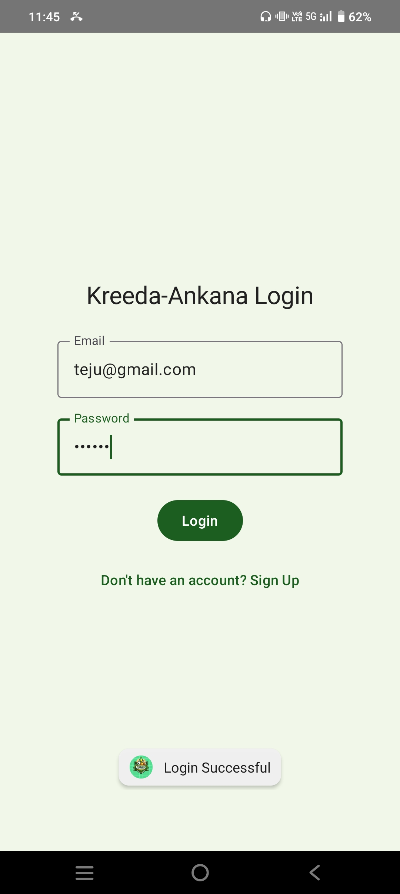
  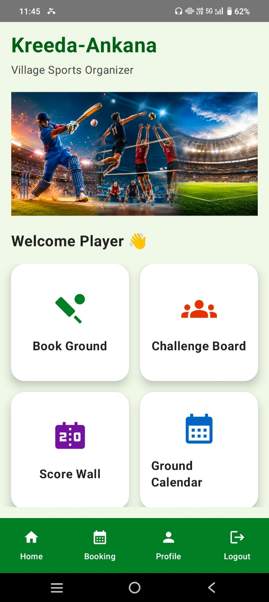
</p>

<p align="center">
  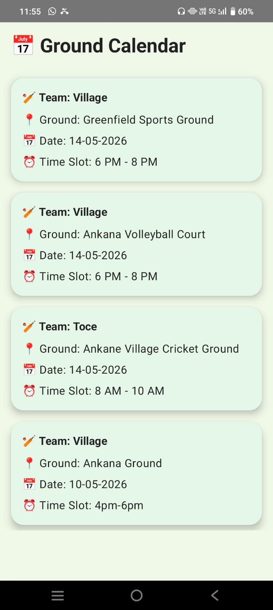
  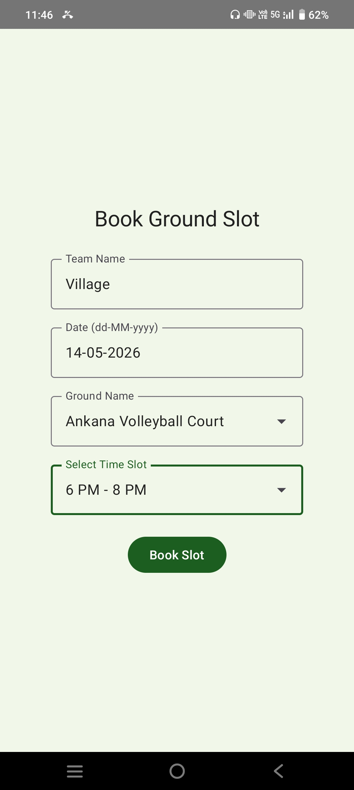
</p>

<p align="center">
  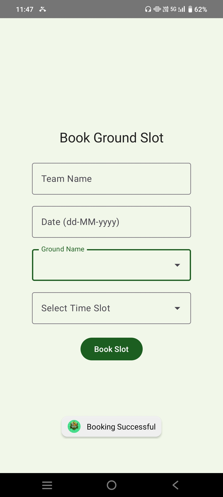
  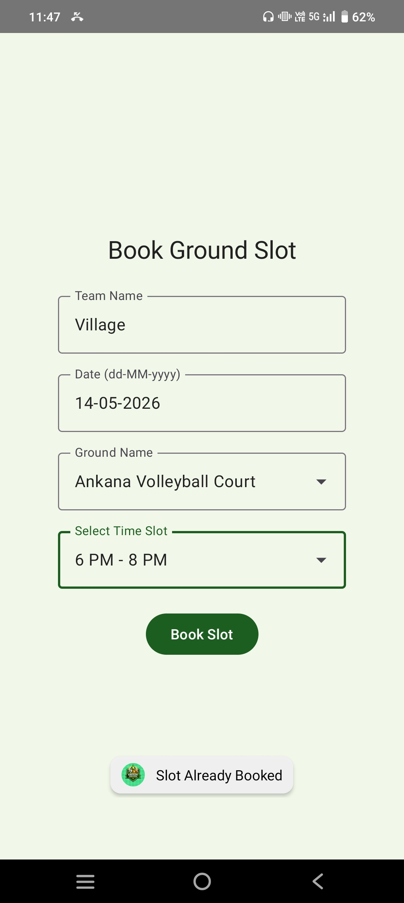
</p>

<p align="center">
  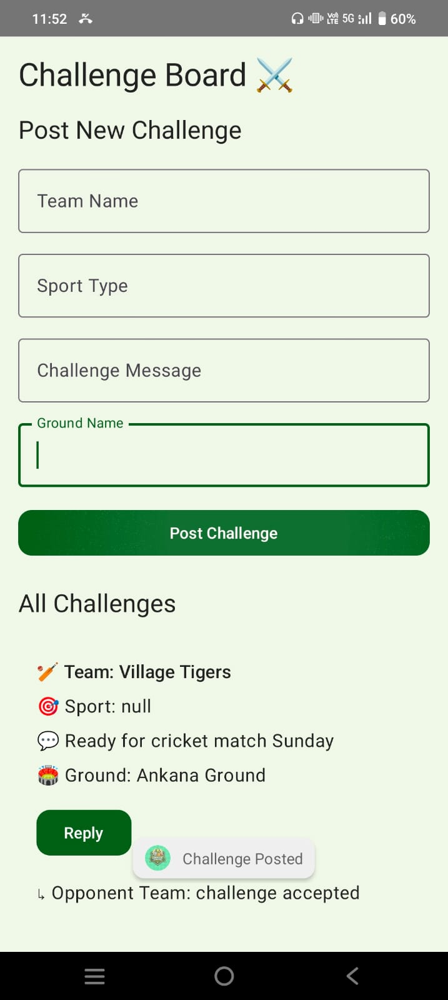
  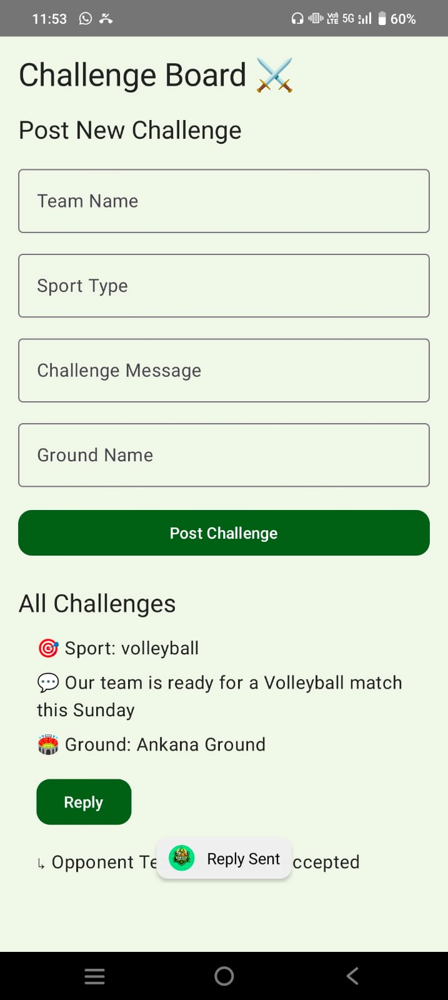
</p>

<p align="center">
  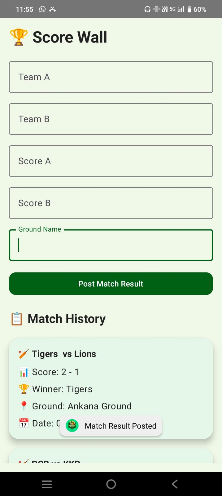
  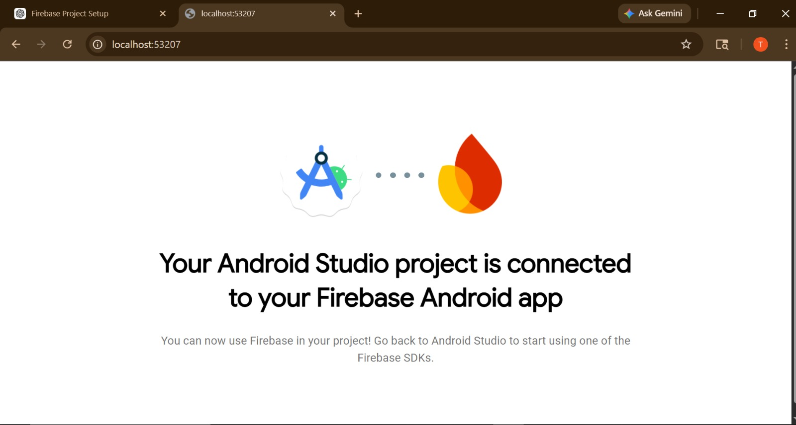
</p>

<p align="center">
  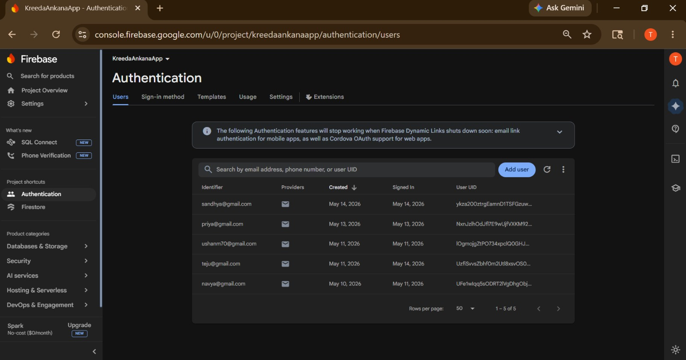
  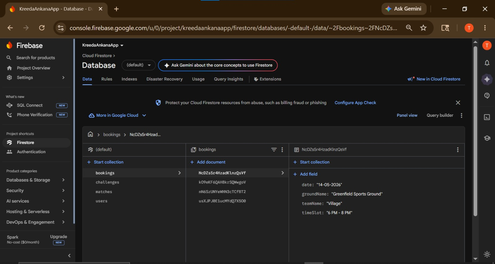
</p>

<p align="center">
  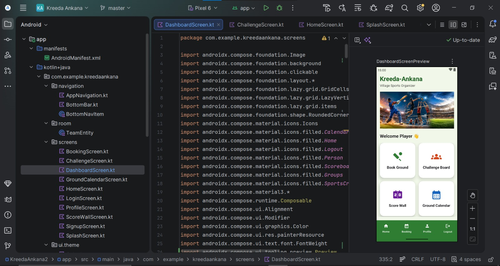
</p>

---

# ⚙️ Technical Implementation

- Firebase integration for real-time data
- Room Database for storing team and match data
- Authentication system using Firebase
- Booking and challenge management system
- Responsive and modern Android UI

---

# 🎯 Impact Goals

- Encourage organized sports culture
- Improve coordination between teams
- Increase participation in sports
- Promote community engagement

---

# ✅ Success Criteria

- Prevent double booking
- Enable challenge replies
- Provide smooth user interface
- Ensure efficient sports event management

---

# 🚀 Installation Guide

## Clone Repository

```bash
git clone https://github.com/Tejashwini-d123/Kreeda-Ankana-App.git
```

## Open in Android Studio

1. Open Android Studio
2. Click **Open Project**
3. Select `Kreeda-Ankana-App` folder
4. Sync Gradle files
5. Run the application

---

# 📂 Project Structure

```bash
Kreeda-Ankana-App/
│
├── app/
│   ├── src/
│   │   ├── main/
│   │   │   ├── java/com/example/kreedaankana/
│   │   │   ├── res/
│   │   │   └── AndroidManifest.xml
│   │   └── test/
│   ├── build.gradle.kts
│
├── gradle/
├── build.gradle.kts
├── settings.gradle.kts
├── gradle.properties
├── gradlew
├── gradlew.bat
└── README.md
```

---

# 📈 Project Status

✅ Application Development Completed Successfully  
✅ Internship Platform Submission Completed

---

# 👩‍💻 Developed By

**Tejashwini N**

🔗 GitHub Profile:  
https://github.com/Tejashwini-d123

🔗 Project Repository:  
https://github.com/Tejashwini-d123/Kreeda-Ankana-App

---

# ⭐ Acknowledgement

Developed as part of the MindMatrix VTU Internship Program.
